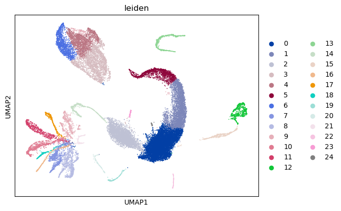
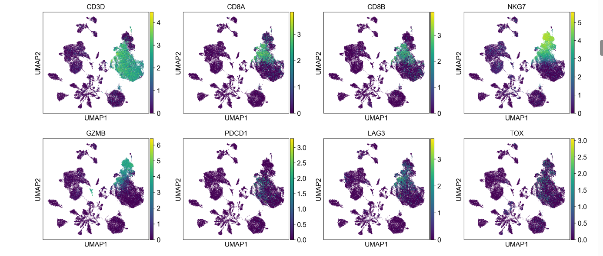
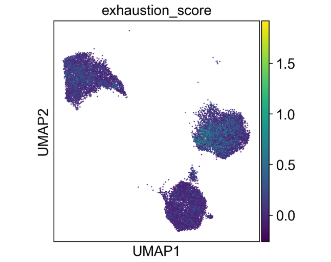
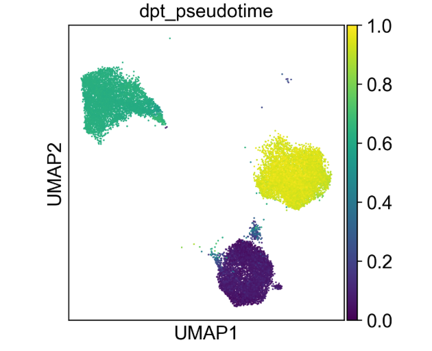
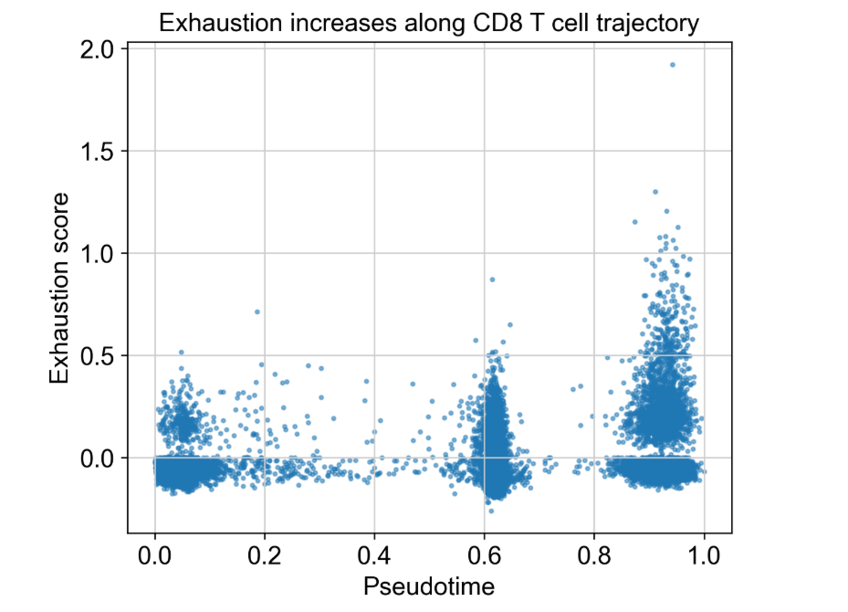
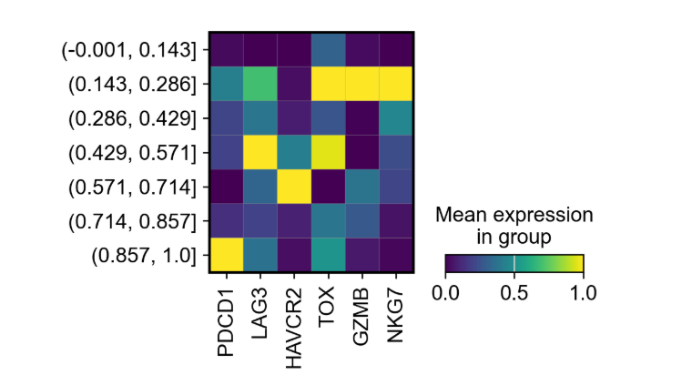

# Immune Evasion in Lung Squamous Cell Carcinoma

## Single-cell RNA-seq reconstruction of CD8⁺ T-cell exhaustion

Single-cell transcriptomic analysis of the lung squamous cell carcinoma (LUSC) tumor microenvironment using Python, Scanpy, and trajectory inference.

This project investigates whether tumor-infiltrating CD8⁺ T cells undergo progressive functional exhaustion and how this process may contribute to immune evasion.

---

## Project Highlights

✔ Single-cell RNA-seq analysis

✔ CD8 T-cell exhaustion modeling

✔ Diffusion pseudotime trajectory inference

✔ Immune evasion characterization

✔ Exhaustion signature scoring

✔ Differential expression analysis

✔ Tumor microenvironment profiling

✔ Reproducible Scanpy workflow

---

## Biological Question

Cytotoxic CD8⁺ T cells infiltrate many tumors, yet cancers frequently survive.

One major hypothesis is **T-cell exhaustion** — a dysfunctional differentiation state caused by chronic antigen stimulation within the tumor microenvironment.

This project investigates whether tumor-infiltrating CD8⁺ T cells in human lung squamous cell carcinoma undergo a progressive transition into an exhausted state.

---

## Key Result

Using single-cell RNA-seq trajectory analysis, this study demonstrates:

**Tumor CD8 T cells are not absent — they are progressively disabled.**

A continuous differentiation trajectory was reconstructed:

**Cytotoxic Effector → Transitional → Terminally Exhausted T Cell**

Exhaustion markers progressively increase along pseudotime, supporting a model of immune evasion through functional suppression rather than immune exclusion.

---

## Main Findings

### CD8 T cells remain present within tumors

Immune evasion appears to occur through functional suppression rather than complete immune exclusion.

### Exhaustion increases continuously along pseudotime

Checkpoint receptor expression progressively increases during differentiation.

### Cytotoxic programs are replaced by exhaustion-associated states

Late-stage cells show elevated expression of PDCD1, TOX, LAG3, and HAVCR2.

### Tumor immune dysfunction can be reconstructed at single-cell resolution

Trajectory analysis reveals a continuous transition from effector to terminally exhausted T-cell states.

---

## Overview of Analysis

### Tumor Immune Landscape

All cells were clustered using Leiden clustering, revealing multiple immune populations including T cells, NK cells, B cells, and myeloid cells.

---

### Identification of CD8 T Cells

Canonical markers (CD3D, CD8A, CD8B, NKG7, GZMB) were used to identify cytotoxic T lymphocytes.

---

### Exhaustion Phenotype

An exhaustion gene signature (PDCD1, LAG3, HAVCR2, TOX) identifies a dysfunctional subset of tumor-infiltrating T cells.

---

### Differentiation Trajectory (Pseudotime)

Diffusion pseudotime reconstructs T-cell differentiation within the tumor.

---

### Functional Inactivation Along Trajectory

Exhaustion increases with pseudotime, indicating progressive acquisition of dysfunction.

---

### Gene Programs Driving Exhaustion

Early cells express cytotoxic genes (GZMB, NKG7), while late cells upregulate checkpoint and regulatory genes (PDCD1, TOX, HAVCR2, LAG3).

---

## Potential Clinical Relevance

The analysis suggests that tumor-infiltrating CD8⁺ T cells in LUSC are present but progressively acquire exhaustion-associated transcriptional programs.

Potential implications include:

* understanding response to immune checkpoint inhibitors
* identification of exhaustion-associated biomarkers
* characterization of immune dysfunction within tumors
* support for future immunotherapy research

This project is intended for research and educational purposes only and is not designed for clinical decision-making.
